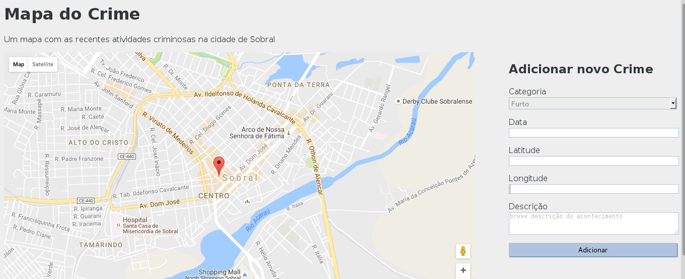

# CrimeMap
Exemplo do livro Flask By Examples

##Descrição:
Esse projeto exemplo tem por objetivo gerar um mapa com crimes relatados pelos usuários. Os pontos marcados pelos usuários serão salvos e vistos por quem acessar esse mapa.

##Tela do Projeto:

